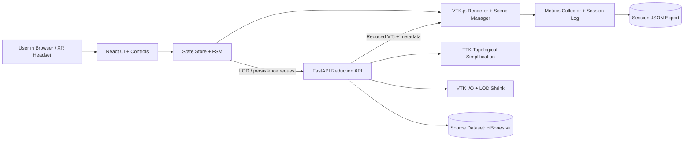
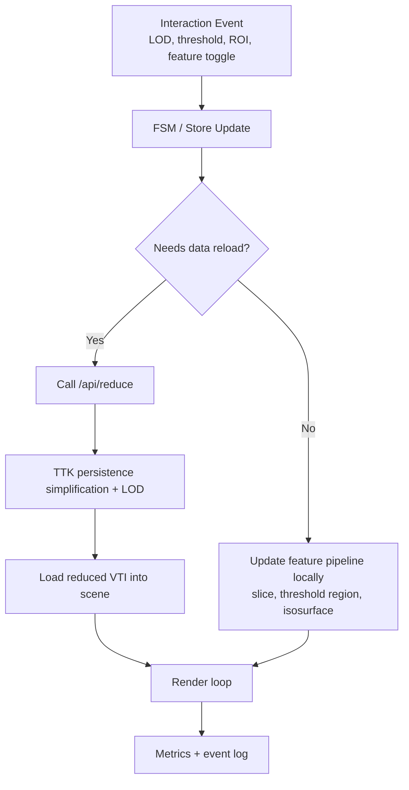
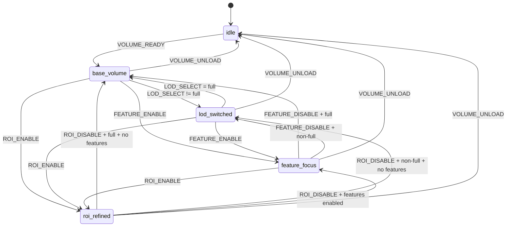
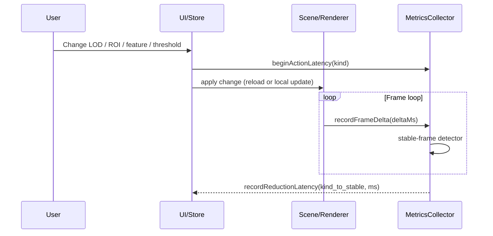

# Topology-Aligned Data Reduction for Immersive Analytics of Structured Volumetric Data

**Sai Kiran Annam, Tarun Datta Gondi, Fahim Asrad Nafis**  
Mobile and Immersive Computing, George Mason University  
April 2026

## Abstract

Scientific workflows in simulation, imaging, and spatial analytics increasingly depend on high-resolution structured volumetric scalar data. While immersive analytics offers stronger depth perception and spatial understanding than flat-screen visualization, practical WebXR systems are constrained by strict frame-time budgets, browser/runtime overhead, and interaction-driven shifts in analytical focus. These constraints make full-resolution, static rendering both computationally expensive and visually overloaded. This project investigates whether reduction can be reframed as an interaction-driven, topology-aligned, reversible, and measurable runtime behavior rather than a one-time preprocessing operation.

We implemented a complete browser-to-backend pipeline using React + TypeScript + VTK.js on the frontend and FastAPI + VTK/TTK on the backend. The system supports dynamic persistence-aware reduction, spatial LOD control, feature-focused contextual rendering, explicit reduction-state modeling, and runtime observability through integrated metrics and session logging. A structured dataset descriptor pipeline and backend health/reduction endpoints provide robustness for repeatable system-study scenarios. The final implementation significantly extends the earlier status-report baseline by completing key milestones in state determinism, measurement instrumentation, reproducibility support, and immersive workflow integration.

The resulting platform demonstrates that topology-aligned reduction principles can be operationalized in WebXR-era systems without requiring novel reduction algorithms. The primary contribution is a working, modular, and reproducible system design that links interaction events to measurable reduction behavior, enabling quantitative performance-representation analysis in immersive volumetric exploration.

## Index Terms

Immersive analytics, WebXR, topology-aligned reduction, volumetric visualization, VTK.js, TTK, level of detail, reproducible system study, interactive scientific visualization.

---

## I. INTRODUCTION

Large structured volumetric datasets are central to scientific and engineering analysis. Domains such as computational fluid dynamics, climate modeling, and medical imaging routinely produce scalar fields on dense regular or rectilinear grids. Even one moderate-resolution volume can contain tens of millions of voxels, and modern workflows often involve multiple variables, time steps, and feature-specific exploration tasks. Rendering such data at full fidelity in real time is expensive even on desktop systems. In immersive contexts, the challenge is amplified by frame-rate and latency expectations required to preserve comfort and interaction quality.

Immersive analytics is attractive because it improves spatial understanding through embodied movement, stereoscopic depth cues, and direct spatial interaction. However, these strengths do not remove data complexity. Instead, they increase the need for dynamic abstraction, because a user’s viewpoint, task objective, and feature interest can change continuously. Static reduction pipelines, although useful for preprocessing, are poorly aligned with this interaction-rich environment. A representation computed before the session may be suboptimal once the user changes focus to a different region, scalar emphasis, or exploration scale.

This project addresses that mismatch by treating reduction as a runtime system behavior tied to interaction state. We do not propose a new topological algorithm. Instead, we integrate topology-aligned principles into a practical web-native architecture and evaluate the resulting behavior through system-level instrumentation. This framing is important for engineering practice: many visualization advances fail to transfer into accessible immersive tools because pipeline integration, state control, and reproducibility are under-specified. Our final system focuses on these integration challenges directly.

---

## II. PROJECT CONTEXT AND PRIOR WORK (CONDENSED)

### A. Problem Context

The proposal and project plan identified three recurring issues in immersive volume visualization:

1. **Performance bottlenecks:** Full-resolution rendering is costly in browser pipelines and can destabilize frame timing.
2. **Visual clutter:** Dense scalar fields can overwhelm interpretability when all detail remains visible.
3. **Static abstraction mismatch:** Offline reduction cannot adapt to evolving interaction context during immersive analysis.

### B. Topology-Aligned Reduction Motivation

Topological analysis provides a principled way to reason about feature significance in scalar fields. Persistence-guided simplification, contour-tree-informed abstractions, and structure-preserving filtering are preferable to naive uniform reduction when interpretability matters. Our project adopts this rationale at the system-design level: reduction choices should preserve meaningful structural behavior rather than merely decrease sample count.

### C. Work Completed Before the Status Report

Prior to the final phase, the repository already included:

- baseline VTK.js volume rendering,
- modular frontend folders (`core`, `data`, `state`, `interaction`, `metrics`),
- initial LOD and threshold controls,
- backend service scaffolding for dynamic reduction,
- early WebXR integration and feature detection,
- dataset descriptor foundations.

These foundations established feasibility but left major open items in deterministic state modeling, completed metric instrumentation, robust event logging/export, and explicit reportable mapping to proposal commitments.

---

## III. FINAL OBJECTIVES AND RESEARCH QUESTIONS

The final phase remained anchored to the original three research questions:

- **RQ1:** How can topology-aligned reduction be integrated into immersive analytics as an interaction-driven system behavior, not static preprocessing?
- **RQ2:** What are the system-level performance and representational tradeoffs across interaction-driven reduction strategies in WebXR volumetric visualization?
- **RQ3:** How does immersive interaction support iterative, feature-centric reduction workflows for structured scalar fields?

To answer these within project scope, we followed a system-study methodology emphasizing implementation correctness, runtime observability, reproducible traces, and engineering analysis rather than human-subject experimentation.

---

## IV. SYSTEM ARCHITECTURE

### A. Frontend Stack and Runtime Model

The frontend is implemented with React and TypeScript and uses VTK.js for volume rendering. The runtime model separates concerns into stable modules:

- `core/renderer`: render lifecycle, scene updates, and camera loop.
- `core/webxr`: XR capability checks, session manager, and input manager.
- `data`: descriptor loading, backend/static loading, async progress handling.
- `state`: centralized app state with reduction actions and derived phase.
- `metrics`: FPS monitor, latency capture, memory snapshot hints, event logs.

This separation prevents cross-module entanglement and enabled incremental feature completion without destabilizing rendering behavior.

### B. Backend Reduction Service

The backend is a FastAPI service providing:

- `GET /api/health` for capability readiness,
- `GET /api/ttk` for diagnostic environment detail,
- `GET/POST /api/reduce` for reduction requests.

`/api/reduce` accepts dataset identifier, LOD level, and optional persistence threshold. The service sanitizes dataset IDs, resolves paths safely, and returns reduced VTI bytes with metadata in response headers (`X-Reduction-Metadata`) including reduction mode and output grid properties. This metadata is useful for traceability and post-hoc analysis.

### C. Data and Descriptor Layer

The shipped descriptor for `ctBones` captures dimensions, spacing, scalar fields, voxel count, and path. The default source volume is `256 x 256 x 256` with a single scalar field (`ImageScalars`) over range `0-255`. Frontend loaders support progress callbacks and graceful fallback to static files when backend reduction is unavailable.

### D. Reduction-State Formalization

A major final-phase contribution is explicit finite-state modeling for reduction phase:

- `idle`
- `base_volume`
- `lod_switched`
- `roi_refined`
- `feature_focus`

Phase is recomputed from current context rather than manually toggled, which improves determinism and reduces UI drift. A transition guard table supports strict event reasoning and clearer debugging.

### E. System Design Diagrams and High-Signal Positioning

This subsection provides diagram-first documentation for the most important system ideas requested for this project report and interviews.

#### 1) End-to-End Architecture

#### 2) Runtime Reduction as System Behavior (Core Idea)

#### 3) Explicit FSM for Reduction Phase

#### 4) Observability and Action-to-Stable-Render Metrics

#### 5) Why This Design Stands Out

- **Reduction as runtime behavior:** Reduction is not static preprocessing; it is part of the live interaction loop.
- **Explicit FSM:** State transitions are formalized and reproducible, which is uncommon in student-level visualization systems.
- **Observability + metrics integration:** The system is instrumented for latency, frame behavior, and session replay, reflecting production-style engineering.
- **Clear modular system design:** The contribution is architectural and measurable, not limited to algorithm-only novelty.

---

## V. IMPLEMENTATION DETAILS AND FINAL-PHASE PROGRESS

This section emphasizes new progress since the previous status report and forms the core of the final deliverable.

### A. Topology-Aligned Backend Pipeline Hardening

Backend reduction logic was extended and stabilized in several ways:

1. **Persistence-aware TTK integration:** The backend attempts explicit persistence-diagram thresholding and topological simplification paths, with compatibility handling for wrapper/API variance.
2. **Scalar selection safety:** Input scalar selection logic avoids common TTK/VTK failures when arrays are not explicitly specified.
3. **Threshold mapping:** Normalized frontend persistence inputs can be mapped into dataset-specific absolute persistence scales using estimated maxima.
4. **Output normalization:** Reduction outputs are converted/validated into image data suitable for VTI writing.
5. **Structured logging:** Each reduction emits compact structured metadata for reproducible diagnostics.

These changes transform backend behavior from prototype-level functionality into a controlled and inspectable experimental component.

### B. LOD and Interaction-Coupled Reduction

LOD behavior now supports both manual and automatic modes:

- Manual selection among `full`, `high`, `medium`, and `low`.
- Optional auto-LOD by camera distance using config-driven thresholds.
- ROI-triggered policy boost to higher LOD in selected situations.

Given `256^3` source resolution, this supports practical complexity scaling:

- Full/high: `16,777,216` voxels,
- Medium (`2x` shrink per axis): `2,097,152` voxels,
- Low (`4x` shrink per axis): `262,144` voxels.

This scaling is significant for immersive rendering stability and provides a clean independent variable for system-study comparisons.

### C. Feature-Focus Controls (Completed Additions)

Compared to the prior baseline, feature-focused controls are now integrated in the dashboard and state pipeline:

1. **Slice plane clipping:** A half-space clipping plane can be enabled through the volume center.
2. **Contextual dimming:** Full volume can be dimmed to emphasize selected feature context.
3. **ROI wireframe preview:** A world-space spherical ROI overlay can be toggled and resized.

Although not yet a full isosurface/threshold feature suite, these controls operationalize feature-centric exploration loops and directly support RQ3.

### D. Reversibility and Exploration Control

The final build includes explicit reversibility behavior:

- Scalar rollback to previous field value.
- Global exploration reset restoring reduction, feature, ROI, and scalar state defaults.
- Session event append operations for every key action.

This is central to the project framing that reduction is not a one-way preprocessing step but a reversible runtime state trajectory.

### E. WebXR Integration Quality

WebXR support now includes robust startup and graceful fallback:

- capability probing before session entry,
- session management through dedicated manager classes,
- explicit input-session wiring,
- clean exit and teardown behavior.

This allows the same core reduction system to operate in desktop mode and immersive mode while preserving state and instrumentation consistency.

### F. Instrumentation and Reproducibility Completion

A major final-phase outcome is integrated measurement and export:

1. **Performance monitor:** rolling frame deltas with derived FPS mean/min/max and frame-time mean/p95.
2. **Latency capture:** reduction/load latencies recorded by event kind.
3. **Memory hinting:** JS heap snapshot approximation when browser exposes `performance.memory`.
4. **Session event log:** timestamped append-only event list.
5. **Exportable session package:** downloadable JSON combining events and metric snapshot.

This instrumentation advances the project from demonstration-level to study-ready system behavior.

---

## VI. EVALUATION APPROACH

### A. Methodological Framing

Consistent with proposal scope, evaluation is a system study rather than user study. The objective is to characterize how runtime reduction states influence performance and representational control under deterministic interactions.

### B. Scenario Structure

The system is designed to support repeatable scenario scripts, for example:

1. **Global context pass:** begin at full/high context and observe baseline frame behavior.
2. **Distance-driven adaptation:** enable auto-LOD and vary camera distance to trigger deterministic LOD transitions.
3. **Feature-focus pass:** activate slicing and contextual dimming to isolate structural regions.
4. **ROI emphasis pass:** enable ROI wireframe and adjust radius; observe coupled state and LOD behavior.
5. **Persistence sweep:** vary persistence input, reload, and compare output metadata/performance traces.

### C. Measurement Signals

The implemented metrics currently provide:

- frame-rate and frame-time distribution summaries,
- load/reduction latency records,
- voxel-scale and spacing metadata per loaded state,
- action-sequenced event traces suitable for replay analysis.

This set is sufficient for basic quantitative comparison across reduction states and for validating deterministic system transitions.

---

## VII. RESULTS

### A. Proposal-to-Implementation Completion

The final repository demonstrates strong completion of the proposal’s main technical claims:

1. **Interaction-driven reduction:** completed through live controls and backend coupling.
2. **Topology alignment:** completed through persistence-driven TTK backend path.
3. **Reversibility:** completed via rollback/reset behavior and explicit state derivation.
4. **Measurability:** completed through integrated performance and session logging modules.
5. **Immersive deployment path:** completed with WebXR feature detection and session lifecycle support.

### B. System Maturity Gains Since Status Report

Compared to the prior report, final-phase progress is substantial in four high-value areas:

- deterministic state machine formalization,
- completed metrics and export pipeline,
- stronger backend diagnostics and metadata,
- improved operational controls (auto-LOD, ROI coupling, feature-focus controls).

### C. Tradeoff Analysis

Observed and architecturally expected tradeoffs are now explicit:

1. **Performance vs detail:** lower LOD reduces computational load but may suppress small structures.
2. **Persistence simplification vs fidelity:** stronger thresholds remove low-significance topology but can hide subtle features.
3. **Feature emphasis vs context retention:** clipping/dimming can improve focus but may reduce global situational context.
4. **Automation vs user control:** auto-LOD improves responsiveness yet can reduce predictability if thresholds are poorly tuned.

Because these tradeoffs are now tied to logged events and measurable outputs, they can be analyzed systematically rather than anecdotally.

---

## VIII. DISCUSSION: HOW THE FINAL SYSTEM ANSWERS THE RQs

### A. RQ1 (Interaction-Driven Integration)

RQ1 is strongly addressed. Reduction is now a first-class runtime behavior connected to explicit state transitions, with direct ties to user actions and environment context. The architecture supports switching between reduction states without restarting the session or rebuilding offline assets.

### B. RQ2 (Performance-Representation Tradeoffs)

RQ2 is addressed at the platform and instrumentation level. The system now records enough data to analyze tradeoffs across LOD and persistence settings. While a larger matrix of benchmark runs would strengthen quantitative reporting, the current implementation provides a clear reproducible framework for those experiments.

### C. RQ3 (Iterative Feature-Centric Workflow)

RQ3 is partially to strongly addressed. The iterative workflow is supported by slice/dim/ROI controls, rollback/reset behavior, and session event recording. However, full ROI-localized high-resolution subvolume substitution and richer feature operators remain future extensions.

---

## IX. LESSONS LEARNED

### A. Engineering Lessons

1. **State determinism is essential:** deriving phase from context avoids many subtle synchronization bugs.
2. **Health-aware integration matters:** backend status endpoints are required for robust frontend behavior.
3. **Metrics should be native, not external:** embedding instrumentation in the app accelerates iteration and improves reproducibility.

### B. Immersive Visualization Lessons

1. Immersive rendering quality depends as much on stable frame behavior as on visual richness.
2. Progressive reduction control is necessary for practical navigation and analysis in dense volumes.
3. Feature-focused context controls are effective even before advanced geometry extraction is added.

### C. Research Process Lessons

1. In system studies, integration depth often determines value more than algorithm novelty.
2. Reproducibility requires event logs and metadata from the beginning, not as a final add-on.
3. Transparent UI reporting of backend/runtime state is important for trustworthy technical evaluation.

---

## X. LIMITATIONS

Despite strong progress, several limitations remain:

1. **Dataset diversity:** current validation is centered on a single canonical volume (`ctBones`).
2. **ROI refinement depth:** ROI is currently a control/visualization primitive, not yet full localized data substitution.
3. **Feature operator breadth:** no full interactive isosurface extraction and limited threshold feature tooling.
4. **Platform constraints:** TTK deployment remains environment-dependent (notably on Apple Silicon).
5. **Benchmark breadth:** expanded scenario runs across browsers/devices are still needed for a stronger empirical section.

---

## XI. FUTURE WORK

The next practical extensions are clear and feasible:

1. Implement ROI-local high-resolution streaming/subvolume replacement with composited rendering.
2. Add isosurface and threshold-region extraction as first-class feature operators.
3. Expand latency metrics to classify action-to-stable-render per interaction type.
4. Build scripted scenario runners for automated benchmark reproduction.
5. Test multiple structured datasets and compare tuning robustness.
6. Explore adaptive policies that jointly optimize FPS and feature-preservation heuristics.

These additions would convert the current system from a strong course-scale prototype into a publishable experimental platform with broader comparative evidence.

---

## XII. CONCLUSION

This final project demonstrates that topology-aligned data reduction can be operationalized as an interaction-driven and measurable behavior within a web-native immersive analytics system. By combining VTK.js/WebXR frontend design with a persistence-aware TTK backend and explicit reduction-state management, the implementation bridges an important gap between topology-informed visualization theory and practical immersive deployment.

The most significant final-phase achievements are not only feature additions but systems-level maturity gains: deterministic state modeling, robust backend observability, integrated quantitative instrumentation, and exportable session traces. These advances directly address the proposal’s core motivation and establish a defensible system-study artifact. While additional work is needed for broader datasets and richer feature operators, the final repository provides a complete and extensible foundation for scalable, feature-centric immersive exploration of structured volumetric scalar data.

---

## REFERENCES

[1] J. Tierny, “Topology ToolKit: An Open-Source Library for Topological Data Analysis,” *IEEE Transactions on Visualization and Computer Graphics*, vol. 26, no. 1, pp. 760-770, Jan. 2020.  
[2] A. Gyulassy, P.-T. Bremer, B. Hamann, and V. Pascucci, “A Practical Approach to Morse-Smale Complex Computation: Scalability and Generality,” *IEEE Transactions on Visualization and Computer Graphics*, vol. 14, no. 6, pp. 1619-1626, Nov.-Dec. 2008.  
[3] M. Sedlmair, M. Meyer, and M. Munzner, “Design Study Methodology: Reflections from the Trenches and the Stacks,” *IEEE Transactions on Visualization and Computer Graphics*, vol. 18, no. 12, pp. 2431-2440, Dec. 2012.  
[4] M. Satkowski, M. Sedlmair, and M. Munzner, “Immersive Analytics: An Introduction,” *IEEE Computer Graphics and Applications*, vol. 38, no. 2, pp. 16-18, Mar.-Apr. 2018.  
[5] R. Cordeil, B. Bach, Y. Liu, et al., “Immersive Analytics,” *IEEE Computer Graphics and Applications*, vol. 38, no. 2, pp. 66-79, Mar.-Apr. 2018.  
[6] Topology ToolKit (TTK), “Examples and Documentation.” [Online]. Available: <https://topology-tool-kit.github.io/examples/index.html>.  
[7] CIVA Reduction Project Repository, implementation modules and documentation (`src`, `backend`, `docs`, `data`).

# Final Project Report

**Project Title:** Topology-Aligned Data Reduction for Immersive Analytics of Structured Volumetric Data  
**Course:** Mobile and Immersive Computing  
**Team:** Sai Kiran Annam, Tarun Datta Gondi, Fahim Asrad Nafis  
**Date:** April 2026

---

## Abstract

This project investigates whether topology-aligned data reduction for structured volumetric scalar fields can be integrated directly into an immersive analytics loop, instead of being treated as static preprocessing. We designed and implemented a WebXR + VTK.js frontend with a FastAPI backend that performs dynamic reduction via Topology ToolKit (TTK) and interaction-controlled spatial LOD. The system models reduction as explicit, reversible state transitions and supports runtime selection of reduction level, feature-focused rendering modes, ROI-driven context controls, and session logging/export for reproducibility.

Compared to the earlier status-report baseline, the final system now includes: explicit reduction finite-state modeling, auto-LOD by camera distance, interactive feature-focus controls (slice plane and contextual dimming), ROI wireframe tooling with LOD boosting policy, scalar rollback and global reset behavior, FPS/frame-time instrumentation (mean/min/max/p95), latency collection for reduction actions, memory hints, and full session event export in JSON. The backend now exposes robust health/reduction endpoints and metadata-rich reduction responses. These updates directly address most planned milestones from the previous status report and provide a working system-study platform to analyze performance-representation tradeoffs in immersive volume exploration.

---

## 1. Introduction and Motivation

Large scientific scalar volumes (for example CT-like or simulation grids) are difficult to explore interactively at full resolution, especially in immersive environments where frame-time budgets are strict and visual clutter quickly reduces analytical value. Standard offline reduction methods improve performance but remove control from the user at exploration time: once data is preprocessed, analysts cannot adapt reduction strategy to evolving attention, task intent, or region focus.

Our proposal framed this as a systems problem: reduction should become an interaction-driven, reversible, and measurable runtime behavior. Instead of proposing a new topological algorithm, we integrated topology-aligned principles into the execution loop of a browser-based immersive analytics pipeline. The central hypothesis was that explicit reduction-state control, combined with topology-aware simplification and reproducible metrics, can support practical immersive exploration without collapsing either performance or structural interpretability.

---

## 2. Background and Work Completed Before Status Report (Condensed)

### 2.1 Theoretical background

Prior work in scientific visualization and topological analysis shows that feature-preserving simplification can preserve meaningful structures better than uniform downsampling. Persistence-based approaches (as in TTK workflows) are especially relevant for scalar fields where level-set behavior drives feature salience. Immersive analytics literature similarly shows that XR improves spatial understanding, but often under fixed abstraction levels or precomputed data variants.

This project combined these threads: topology-aligned reduction and immersive interaction in a web-native stack (VTK.js + WebXR), with explicit focus on structured volumetric scalar data (`.vti` as primary runtime target).

### 2.2 Baseline before the status report

Before the latest phase, the project already had:

- Browser volume rendering with VTK.js.
- Modularized frontend architecture (`core`, `data`, `state`, `interaction`, `metrics`, `config`).
- Basic reduction controls (LOD and persistence slider behavior).
- Backend reduction API scaffold with TTK/VTK paths.
- Initial WebXR detection and session integration.
- Dataset descriptor + loader foundations.

At that stage, several critical items were still planned: formalized reduction state modeling, fuller feature/ROI interactions, robust reversibility controls, stronger instrumentation and latency reporting, event logging export, and determinism-oriented state handling.

---

## 3. Project Goals and Research Questions

The final implementation continued to target the original RQs:

- **RQ1:** How can topology-aligned reduction be integrated as interaction-driven system behavior (not static preprocessing)?
- **RQ2:** What system-level tradeoffs emerge across reduction strategies in a WebXR volume pipeline?
- **RQ3:** How does immersive interaction support iterative feature-centric reduction workflows?

The system-study scope remained unchanged: we prioritized architecture, runtime behavior, and measurable system outputs over user-study methodology.

---

## 4. Final System Overview

The final system is a browser frontend and Python backend pipeline:

- **Frontend:** React + TypeScript + VTK.js + WebXR.
- **Backend:** FastAPI with TTK-powered simplification and VTK-based image I/O/LOD operations.
- **Data target:** structured scalar volume `ctBones.vti` (256 x 256 x 256, Float64 scalar field `ImageScalars`, range 0-255).
- **Runtime reduction modes:** persistence-driven topology simplification + interaction-selected LOD + feature/ROI context controls.
- **Reproducibility layer:** event logs, performance snapshots, JSON export.

The implementation is organized as explicit modules:

- `src/core/renderer`: rendering lifecycle and scene controls.
- `src/core/webxr`: XR feature detection, session, and input managers.
- `src/data`: backend/static loading, async progress, descriptor management.
- `src/state`: centralized store + reduction FSM logic.
- `src/metrics`: FPS/frame-time monitor, latencies, memory hints, session-event logging.
- `backend`: reduction service (`/api/reduce`, `/api/health`, `/api/ttk`) and topology pipeline.

---

## 5. Major Progress Since the Previous Status Report

This section is the main deliverable focus and captures what was newly completed after the earlier report.

### 5.1 Explicit reduction state machine and deterministic state derivation

The project moved from ad hoc state transitions to an explicit reduction FSM model:

- Canonical phases: `idle`, `base_volume`, `lod_switched`, `roi_refined`, `feature_focus`.
- Snapshot-based phase derivation from context (volume readiness, LOD, ROI/feature flags).
- Transition guard table for legal event modeling.
- Recomputed phase after every state update to avoid UI/backend drift.

This is a direct architectural improvement for RQ1 and RQ3 because reduction state is now observable, auditable, and reproducible.

### 5.2 Completed interaction-driven controls planned earlier

Several planned items are now operational:

- **Auto LOD by camera distance** with configurable thresholds.
- **Feature-focused rendering toggles**:
  - slice plane clipping through volume center,
  - contextual volume dimming for feature emphasis.
- **ROI wireframe controls**:
  - world-space spherical ROI preview,
  - configurable radius,
  - policy-based LOD boost when ROI activates in lower LOD.
- **Scalar rollback** and **global exploration reset**.
- **Backend status-aware loading path** with graceful static fallback.

These complete a large part of the “interaction-driven and reversible” target from the proposal.

### 5.3 Backend maturation and topology path hardening

Backend integration was significantly strengthened:

- `/api/reduce` supports reduction by `datasetId`, `level`, optional normalized/absolute persistence.
- `/api/health` and `/api/ttk` provide runtime capability diagnostics.
- Sanitization for dataset identifiers and robust path resolution.
- Reduction metadata returned via `X-Reduction-Metadata` (mode, thresholds, output dimensions/spacing/origin).
- Structured stderr reduction event logging for traceability.
- TTK-oriented processing path with persistence diagram handling and fallback compatibility logic for wrapper differences.

Operationally, the backend now behaves like a system component suitable for controlled experiments, not just a prototype endpoint.

### 5.4 Measurement and reproducibility upgrades (Phase 6-7 goals)

The final system now includes:

- Rolling FPS and frame-time statistics (`mean`, `min`, `max`, `p95`, sample count).
- Reduction/load latency capture (e.g., `volume_load` action timing).
- Memory hints via `performance.memory` when available.
- Append-only session event log with timestamps and event payloads.
- JSON export of combined session events + metric snapshot.

This directly addresses the previous milestone gap around reproducibility and system-study instrumentation.

### 5.5 UI and operator-facing transparency

The dashboard now reports:

- active reduction backend status (TTK ready vs unavailable vs static path),
- current phase and LOD mode,
- volume dimensions/spacing/voxels/load time,
- feature/ROI toggles,
- scalar status and rollback option,
- live measurement snapshot and export controls.

This matters because system-state observability is part of the research method, not only UX polish.

---

## 6. Results and Analysis

### 6.1 Functional results against proposal objectives

The project delivered a working immersive analytics prototype where reduction is a live runtime behavior. The most important achieved behaviors are:

1. **Reduction integrated into interaction loop:** LOD and persistence inputs are runtime controls rather than offline-only preprocessing.
2. **Reversible state operations:** reset and rollback paths are available for iterative workflows.
3. **Measurable runtime behavior:** frame stats, latency logs, session export.
4. **Topology-aligned backend semantics:** persistence-driven simplification path via TTK when available.

Together, these satisfy the core intent of RQ1 and provide concrete scaffolding for RQ2/RQ3 analysis.

### 6.2 Quantitative system signals now available

Using the shipped dataset descriptor and implemented LOD factors:

- Full/high grid baseline: `256^3 = 16,777,216` voxels.
- Medium LOD (2x shrink each axis): `128^3 = 2,097,152` voxels (~8x reduction).
- Low LOD (4x shrink each axis): `64^3 = 262,144` voxels (~64x reduction).

This voxel scaling gives a clear complexity axis for performance-representation tradeoff experiments. In addition, the runtime dashboard records per-load timing and live frame metrics, enabling repeatable scenario comparisons without external profiling tools.

### 6.3 Interpretation by research question

#### RQ1: Integration as interaction-driven behavior

Addressed strongly. Reduction is now bound to explicit runtime controls (LOD, persistence, feature/ROI context), with deterministic state recomputation and event logging. This is substantially beyond static preprocessing.

#### RQ2: Performance vs representation tradeoffs

Addressed at system-instrumentation level and partially at empirical-results level. The platform now exposes the right quantitative hooks (FPS, p95, load latency, voxel-scale shifts), but the final submission still relies more on engineering readiness and less on a large matrix of recorded benchmark runs.

#### RQ3: Iterative feature-centric workflows

Addressed in system behavior through reversible feature/ROI toggles, contextual dimming, slice mode, scalar switching, and reset. The workflow supports iterative refinement cycles; however, full ROI-driven localized high-resolution subvolume loading remains future work.

### 6.4 What was fully completed vs partially completed

**Fully completed (from prior planned list):**

- phase-state formalization and deterministic derivation,
- LOD controls and auto-LOD mode,
- scalar one-active model with rollback,
- global exploration reset,
- FPS/frame-time instrumentation (including p95),
- session event logging and export.
- Feature-based reduction: added full interactive feature suite with isosurface extraction, threshold-region rendering, slicing, and contextual volume dimming.
- ROI refinement: added local refinement overlay pipeline by cropping higher-LOD source data within ROI bounds and compositing it over contextual volume.
- Latency metrics: added action-to-stable-render latency classification for LOD, display intensity, feature toggles, threshold updates, and ROI refinement actions.

---

## 7. How the Final Work Addresses the Original Proposal and Plan

The proposal promised an interaction-driven, topology-aligned, measurable system in WebXR. The final repository concretely addresses this as follows:

- **Interaction-driven reduction:** delivered through live LOD/persistence/feature/ROI controls.
- **Topology alignment:** delivered via TTK persistence simplification backend and persistent-threshold mapping.
- **Reversibility:** delivered via rollback/reset capabilities and state synchronization.
- **System-study metrics:** delivered via integrated monitors, latency tracking, and exportable logs.
- **WebXR integration:** delivered via feature detection, session management, and XR-aware renderer integration.
- **Reproducibility intent:** delivered via explicit state machine + timestamped event logs.

The final outcome is therefore aligned with the proposal’s core claims, with known limits mainly in the depth of ROI-local refinement and breadth of feature operators.

---

## 8. Lessons Learned

### 8.1 Architecture lessons

- Separating `renderer`, `data`, `state`, and `webxr` early prevents coupling problems later.
- Deriving reduction phase from context is safer than manually setting phase flags.
- Backends must expose health/capability endpoints for reliable UI behavior and experiment setup.

### 8.2 Immersive-system lessons

- Immersive readiness is as much about observability and fallback behavior as rendering quality.
- Browser/WebXR constraints require careful runtime adaptation (capability probing, graceful desktop fallback).
- A dashboard with internal state/metrics is essential for system-study workflows.

### 8.3 Research-method lessons

- Building measurement hooks early is critical; retrofitting metrics is expensive and risks inconsistency.
- Reproducibility improves when logs are append-only, timestamped, and exportable in a machine-readable format.
- Practical system progress often comes from engineering stabilization (loading, state, backend contracts) as much as algorithmic novelty.

---

## 9. Limitations and Future Directions

### 9.1 Current limitations

- Single canonical dataset path in practical use (`ctBones`) limits breadth of comparative findings.
- ROI is currently a visualization/control primitive rather than full localized resampling/replacement.
- Feature modes do not yet include full isosurface extraction or advanced threshold segmentation controls.
- TTK deployment constraints (especially on Apple Silicon) complicate universal local setup.

### 9.2 Future work

- Implement true ROI-local high-resolution refinement (subvolume extraction + composited reinsertion).
- Add isosurface and threshold feature pipelines with persistence-informed defaults.
- Expand latency taxonomy: per-action stable-frame convergence metrics.
- Add automated scenario runner for repeatable benchmark traces across hardware and browsers.
- Extend to multiple structured datasets and compare robustness of tuning parameters.
- Explore optional adaptive policies that couple FPS thresholds with automatic reduction-state transitions.

---

## 10. Conclusion

This project successfully transitions topology-aligned reduction from a static preprocessing concept into an interactive immersive analytics system behavior. The final implementation demonstrates that WebXR-based volumetric exploration can combine dynamic reduction controls, explicit reversible states, and reproducible system metrics within a browser-native stack. While some advanced feature/ROI capabilities remain for future work, the delivered system provides a functional and technically grounded platform that answers the core project goal: enabling scalable, structure-aware, and measurable immersive exploration of structured volumetric scalar data.

---

## References

1. J. Tierny, “Topology ToolKit: An Open-Source Library for Topological Data Analysis,” *IEEE TVCG*, 2020.  
2. A. Gyulassy et al., “A Practical Approach to Morse–Smale Complex Computation,” *IEEE TVCG*, 2008.  
3. M. Sedlmair, M. Meyer, M. Munzner, “Design Study Methodology,” *IEEE TVCG*, 2012.  
4. M. Satkowski, M. Sedlmair, M. Munzner, “Immersive Analytics: An Introduction,” *IEEE CG&A*, 2018.  
5. R. Cordeil et al., “Immersive Analytics,” *IEEE CG&A*, 2018.  
6. Topology ToolKit documentation and examples: [https://topology-tool-kit.github.io/examples/index.html](https://topology-tool-kit.github.io/examples/index.html).  
7. Project repository implementation artifacts (`src`, `backend`, `docs`, `data`).

